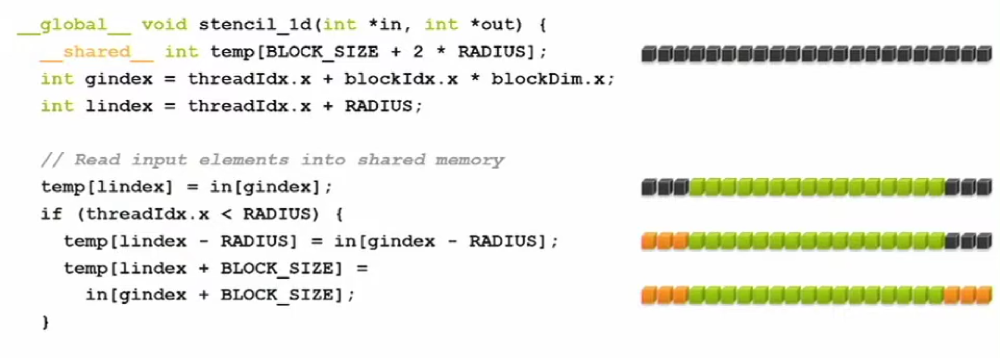

---

marp: true
theme: gaia
paginate: true
highlight: nord


---


<style>
  section {
    background-color: lightblue;
  }
</style>


<style>
section.center {
  display: flex;
  justify-content: center;
  align-items: center;
  text-align: center;
  flex-direction: column;
}
</style>


<style>
section.small {
  font-size: 32px;
}
</style>

<!-- _class: center -->

# CUDA Memory

 
---

<!-- _class: center -->

# GPU/CPU Memory  

---

## CPU Memory vs GPU Memory


 

---

## Host and device memory transfer 

```
cudaMemcpy(d_y, y, N*sizeof(float), cudaMemcpyHostToDevice);

cudaMemcpy(y, d_y, N*sizeof(float), cudaMemcpyDeviceToHost);
```
- data transfer between CPU and GPU 

- We need to call `cudaDeviceSynchronize()` to ensure all GPU operations are completed before copying data from the GPU to the CPU; however, synchronization is not required when copying data from the CPU to the GPU.

- We use `cudaMalloc` and `cudaFree` to manage GPU memories.

---


<!-- _class: center -->

# Shared Memory

---

- threads share data via shared memory in the thread block

- extremely fast to access shared memory compared to L1 cache, L2 cache and global memory 

- comparable with registers 

- data in shared memory is declared as `__shared__`

- shared memory is not shared with other thread blocks 

--- 

__Shared Memory Demo__



---

```

// Synchronize (ensure all the data is available)
__syncthreads();

// Apply the stencil
int result = 0;
for (int offset = -RADIUS; offset <= RADIUS; offset++)
   result += temp[lindex + offset];

// Store the result
out[gindex] = result;

```

- all the threads must reach this barrier `__syncthreads()`.


--- 

__Another Shared Memory Demo__

```
const int DSIZE = 8192;
const int block_size = 32;  // CUDA maximum is 1024 *total* threads in block
const float A_val = 3.0f;
const float B_val = 2.0f;

// matrix multiply (naive) kernel: C = A * B
__global__ void mmul(const float *A, const float *B, float *C, int ds) {

  // declare cache in shared memory
  __shared__ float As[block_size][block_size];
  __shared__ float Bs[block_size][block_size];

  int idx = threadIdx.x+blockDim.x*blockIdx.x; // create thread x index
  int idy = threadIdx.y+blockDim.y*blockIdx.y; // create thread y index

  if ((idx < ds) && (idy < ds)){
    float temp = 0;
    for (int i = 0; i < ds/block_size; i++) {

      // Load data into shared memory
      As[threadIdx.y][threadIdx.x] = A[idy * ds + (i * block_size + threadIdx.x)];
      Bs[threadIdx.y][threadIdx.x] = B[(i * block_size + threadIdx.y) * ds + idx];

      // Synchronize
      __syncthreads();
```


---

```
 // Keep track of the running sum
      for (int k = 0; k < block_size; k++)
        temp += As[threadIdx.y][k] * Bs[k][threadIdx.x]; // dot product of row and column
      __syncthreads();
    }
    // Write to global memory
    C[idy*ds+idx] = temp;
  }
}
```

- First barrier: make sure shared memory is fully written

- Second barrier: make sure shared memory is fully read before it is reused. 

- [matrix multiplication with shared memory.cu](./code/matrix_mul_shared.cu)
---


