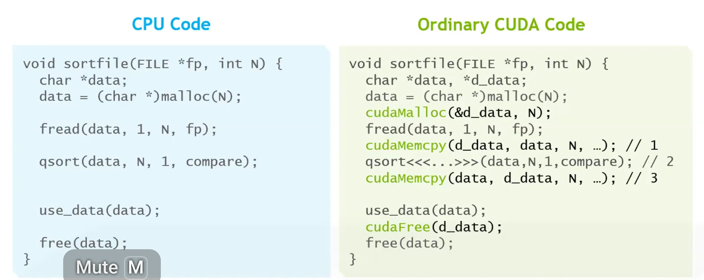

---

marp: true
theme: gaia
paginate: true
highlight: nord


---


<style>
  section {
    background-color: lightblue;
  }
</style>


<style>
section.center {
  display: flex;
  justify-content: center;
  align-items: center;
  text-align: center;
  flex-direction: column;
}
</style>


<style>
section.small {
  font-size: 32px;
}
</style>

<!-- _class: center -->

# CUDA Memory

 
---

<!-- _class: center -->

# GPU/CPU Memory  

---

## CPU Memory vs GPU Memory


--- 


---


---

## Host and device memory transfer 

```
cudaMemcpy(d_y, y, N*sizeof(float), cudaMemcpyHostToDevice);

cudaMemcpy(y, d_y, N*sizeof(float), cudaMemcpyDeviceToHost);
```
- data transfer between CPU and GPU 

- We need to call `cudaDeviceSynchronize()` to ensure all GPU operations are completed before copying data from the GPU to the CPU; however, synchronization is not required when copying data from the CPU to the GPU.

- We use `cudaMalloc` and `cudaFree` to manage GPU memories.

---

<!-- _class: center -->

# Global Memory

---

- Loads:
  - Cache as default
  - Sequence: L1 cache, L2 cache, GMEM
  - The granularity is 128-byte  
  - It is also possible to use the non-cache mode, and in this case the granularity is 32-byte

- Stores:
  - Invalidate L1, write back L2 

--- 

# Coalescing in GMEM

```

// matrix row-sum kernel
__global__ void row_sums(const float *A, float *sums, size_t ds){
  int idx = threadIdx.x+blockDim.x*blockIdx.x; // create typical 1D thread index from built-in variables
  if (idx < ds){
    float sum = 0.0f;
    for (size_t i = 0; i < ds; i++)
      sum += A[idx*ds+i];        
    sums[idx] = sum;
}}

```

---

# Non-Coalescing in GMEM

```

__global__ void column_sums(const float *A, float *sums, size_t ds){
  int idx = threadIdx.x+blockDim.x*blockIdx.x;  
  if (idx < ds){
    float sum = 0.0f;
    for (size_t i = 0; i < ds; i++)
      sum += A[idx+ds*i];    
    sums[idx] = sum;
}}
```

---


<!-- _class: center -->

# Shared Memory

---

- threads share data via shared memory in the thread block

- extremely fast to access shared memory compared to L1 cache, L2 cache and global memory 

- comparable with registers 

- data in shared memory is declared as `__shared__`

- shared memory is not shared with other thread blocks 

--- 

__Shared Memory Demo__


---

```

// Synchronize (ensure all the data is available)
__syncthreads();

// Apply the stencil
int result = 0;
for (int offset = -RADIUS; offset <= RADIUS; offset++)
   result += temp[lindex + offset];

// Store the result
out[gindex] = result;

```

- all the threads must reach this barrier `__syncthreads()`.


--- 

__Shared Memory Demo: Matrix Multiplication__

```
const int DSIZE = 8192;
const int block_size = 32;  // CUDA maximum is 1024 *total* threads in block
const float A_val = 3.0f;
const float B_val = 2.0f;

// matrix multiply (naive) kernel: C = A * B
__global__ void mmul(const float *A, const float *B, float *C, int ds) {

  // declare cache in shared memory
  __shared__ float As[block_size][block_size];
  __shared__ float Bs[block_size][block_size];

  int idx = threadIdx.x+blockDim.x*blockIdx.x; // create thread x index
  int idy = threadIdx.y+blockDim.y*blockIdx.y; // create thread y index

  if ((idx < ds) && (idy < ds)){
    float temp = 0;
    for (int i = 0; i < ds/block_size; i++) {

      // Load data into shared memory
      As[threadIdx.y][threadIdx.x] = A[idy * ds + (i * block_size + threadIdx.x)];
      Bs[threadIdx.y][threadIdx.x] = B[(i * block_size + threadIdx.y) * ds + idx];

      // Synchronize
      __syncthreads();
```


---

```
 // Keep track of the running sum
      for (int k = 0; k < block_size; k++)
        temp += As[threadIdx.y][k] * Bs[k][threadIdx.x]; // dot product of row and column
      __syncthreads();
    }
    // Write to global memory
    C[idy*ds+idx] = temp;
  }
}
```

- First barrier: make sure shared memory is fully written

- Second barrier: make sure shared memory is fully read before it is reused. 

- [matrix multiplication with shared memory.cu](./code/matrix_mul_shared.cu)

---

__Shared Memory Demo: Matrix Row Summrization__


```

__global__ void row_sums(const float *A, float *sums, size_t ds){

  int idx = blockIdx.x; // our block index becomes our row indicator
  if (idx < ds){
     __shared__ float sdata[block_size];
     int tid = threadIdx.x;
     sdata[tid] = 0.0f;
     size_t tidx = tid;

     while (tidx < ds) {  // block stride loop to load data
        sdata[tid] += A[idx*ds+tidx];
        tidx += blockDim.x;  
        }

     for (unsigned int s=blockDim.x/2; s>0; s>>=1) {
        __syncthreads();
        if (tid < s)  // parallel sweep reduction
            sdata[tid] += sdata[tid + s];
        }
     if (tid == 0) sums[idx] = sdata[0];
  }
}
```
---

```
const size_t DSIZE = 16384;      // matrix side dimension
const int block_size = 256;  // CUDA maximum is 1024

float *h_A, *h_sums, *d_A, *d_sums;
h_A = new float[DSIZE*DSIZE];  // allocate space for data in host memory
h_sums = new float[DSIZE]();
for (int i = 0; i < DSIZE*DSIZE; i++)  // initialize matrix in host memory
  h_A[i] = 1.0f;
cudaMalloc(&d_A, DSIZE*DSIZE*sizeof(float));  // allocate device space for A
cudaMalloc(&d_sums, DSIZE*sizeof(float));  // allocate device space for vector d_sums
cudaCheckErrors("cudaMalloc failure"); // error checking
// copy matrix A to device:
cudaMemcpy(d_A, h_A, DSIZE*DSIZE*sizeof(float), cudaMemcpyHostToDevice);
cudaCheckErrors("cudaMemcpy H2D failure");
//cuda processing sequence step 1 is complete
row_sums<<<DSIZE, block_size>>>(d_A, d_sums, DSIZE);
```
---

__Demo Shared Memory and Global Memory Comparison__


[matrix row/col sum.cu](./code/matrix_sum.cu)

--- 
<!-- _class: center -->

# Atomics 

--- 

```
const size_t N = 8ULL*1024ULL*1024ULL;   
const int BLOCK_SIZE = 256;   
__global__ void atomic_red(const float *gdata, float *out){
  size_t idx = threadIdx.x+blockDim.x*blockIdx.x;
  if (idx < N) atomicAdd(out, gdata[idx]);
}

cudaMemset(d_sum, 0, sizeof(float));
  
cudaCheckErrors("cudaMemset failure");

atomic_red<<<(N+BLOCK_SIZE-1)/BLOCK_SIZE, BLOCK_SIZE>>>(d_A, d_sum);

```

--- 

```

__global__ void reduce_a(float *gdata, float *out){
     __shared__ float sdata[BLOCK_SIZE];
     int tid = threadIdx.x;
     sdata[tid] = 0.0f;
     size_t idx = threadIdx.x+blockDim.x*blockIdx.x;

     while (idx < N) {  // grid stride loop to load data
        sdata[tid] += gdata[idx];
        idx += gridDim.x*blockDim.x;  
        }

     for (unsigned int s=blockDim.x/2; s>0; s>>=1) {
        __syncthreads();
        if (tid < s)  // parallel sweep reduction
            sdata[tid] += sdata[tid + s];
        }
     if (tid == 0) atomicAdd(out, sdata[0]);
  }

```

---

<!-- _class: center -->

# Warp Shuffle 

---

```
__global__ void reduce_ws(float *gdata, float *out){
     __shared__ float sdata[32];
     int tid = threadIdx.x;
     int idx = threadIdx.x+blockDim.x*blockIdx.x;
     float val = 0.0f;
     unsigned mask = 0xFFFFFFFFU;
     int lane = threadIdx.x % warpSize;
     int warpID = threadIdx.x / warpSize;
     while (idx < N) {   
        val += gdata[idx];
        idx += gridDim.x*blockDim.x;  
        }

    for (int offset = warpSize/2; offset > 0; offset >>= 1) 
       val += __shfl_down_sync(mask, val, offset);
    if (lane == 0) sdata[warpID] = val;
   __syncthreads(); // put warp results in shared mem

    if (warpID == 0){
       val = (tid < blockDim.x/warpSize)?sdata[lane]:0;
       for (int offset = warpSize/2; offset > 0; offset >>= 1) 
          val += __shfl_down_sync(mask, val, offset);
       if  (tid == 0) atomicAdd(out, val);
     }
}
```

---

<!-- _class: center -->

# Unified/Managed Memory 

---

- Allocate memory once with cudaMallocManaged

- The same pointer is valid on both CPU and GPU

- The system automatically migrates pages between CPU and GPU memory on demand

- Oversubscribe GPU memory (Pascal+). 

- CPU/GPU memory conherence. 


--- 

 

- 

---


