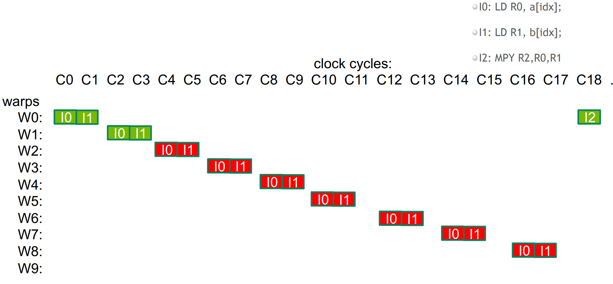

---

marp: true
theme: gaia
paginate: true
highlight: nord


---


<style>
  section {
    background-color: lightblue;
  }
</style>


<style>
section.center {
  display: flex;
  justify-content: center;
  align-items: center;
  text-align: center;
  flex-direction: column;
}
</style>


<style>
section.small {
  font-size: 32px;
}
</style>


<!-- _class: center -->

# CUDA Threads


---
# Hardware vs Software

```
Grid
 └── Block
     └── Warp (32 threads)
         └── Thread (software)
```

```
GPU
 └── SM (Streaming Multiprocessor)
     └── CUDA cores (ALUs)
```

- Threads are executed by scalar processors (SP).
- Thread blocks are executed on multiprocessors (SM).
- A kernel is launched as a grid of thread blocks. 

---

# IDs

- blockIdx, threadIdx   <3D>
- blockDim, gridDim  <3D>

---

## Global Thread ID 


---

## Grid-Stride Loops

```

__global__
void saxpy(int n, float a, float *x, float *y)
{
    int i = blockIdx.x * blockDim.x + threadIdx.x;
    if (i < n) 
        y[i] = a * x[i] + y[i];
}

// Perform SAXPY on 1M elements
saxpy<<<4096,256>>>(1<<20, 2.0, x, y);

__global__
void saxpy(int n, float a, float *x, float *y)
{
    for (int i = blockIdx.x * blockDim.x + threadIdx.x; 
         i < n; 
         i += blockDim.x * gridDim.x) 
      {
          y[i] = a * x[i] + y[i];
      }
}
```


--- 
# Warps

- A warp is excuted physically in parallel (SIMD) on a multiprocessor.

- A thread block consists of warps.


---

# Launch Configuration

- instructions are issued in order

- a thread stalls when one of the operands isn't ready

- latency is hiden by switching threads
  - GMEM latency (>100 cycles)
  - arithmetic latency (<100 cycles) 

---

## GPU Latency Hidding 


---


---



---


- Threads per block should be a multiple of warp size (32)
  - Really small thread blocks prevent achieving good occupancy
  - Really large thread blocks are less flexible
  - Could generally use 128-256 threads/block 

--- 

## Thread Metric: Occupancy 

-  A measure of the actual thread load in an SM, vs. peak theoretical/peak achievable

